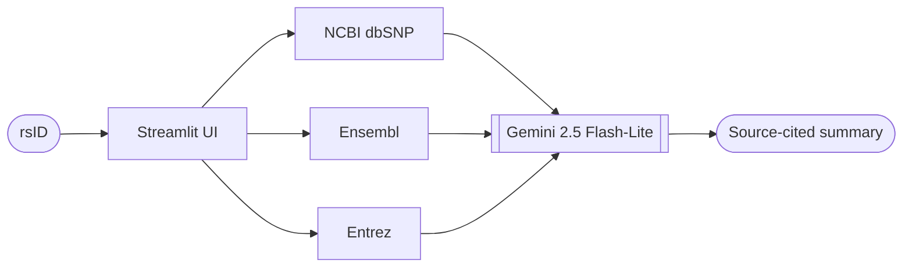

# 🧬 SNP Summary

Paste a SNP `rsID` → get a clean, **source-cited** summary (gene, alleles, clinical significance, linked diseases) in seconds.

> 🏆 **1st Place — 2025 SJSU Bioinformatics Club Hackathon**
> By **Solhee Tucker** & **Heather Ho**

**▶️ [Live demo](https://huggingface.co/spaces/ssol2906/snp-summary)** · `Python` · `Streamlit` · `Gemini` · `Docker` · `Hugging Face Spaces`

<!-- TODO: add a screenshot or GIF of the app here -->

## How it works

Retrieve first, then summarize — the LLM only synthesizes grounded data, so it doesn't invent genomics facts.



## Why it stands out

- **Domain-driven prompting** — we prompt the agent to pull exactly the fields that make a variant interpretable: gene, chromosome, GRCh38 position, alleles, clinical significance, and associated diseases. We encoded *why* a SNP matters into the prompt, not just *what* it is.
- **Verifiable** — we pull live records from 3 public databases; every summary names its sources, and the UI links straight to NCBI / Ensembl / ClinVar for the rsID.
- **Literature-aware** — when records cite papers, we have the agent take a second pass and fold key findings (with sources) into the summary.
- **Robust & free** — runs on Gemini's free tier with graceful rate-limit (429) and error handling.

## Run locally

```bash
git clone https://github.com/ssolh2906/BIBI_Bioinformatics_hackathon.git
cd BIBI_Bioinformatics_hackathon
pip install -r requirements.txt

export GEMINI_API_KEY="your_key"      # free key: https://ai.google.dev/gemini-api/docs/api-key
streamlit run codes/streamlit_ui.py   # then enter an rsID, e.g. 6311
```

Or with Docker:

```bash
docker build -t snp-summary .
docker run -p 7860:7860 -e GEMINI_API_KEY="your_key" snp-summary
```

> The key is read only from `GEMINI_API_KEY` — never committed. On Hugging Face Spaces it's injected as a Space Secret.

## Stack

Streamlit · Google Gemini 2.5 Flash-Lite (`google-genai`) · NCBI dbSNP / Ensembl / Entrez (Biopython, easy-entrez) · Docker · Hugging Face Spaces.

## Roadmap

Accept gene names beyond rsID · tailor summary depth to the reader · add a follow-up chatbot.

---

**Team:** Solhee Tucker · Heather Ho — 2025 SJSU Bioinformatics Club Hackathon.